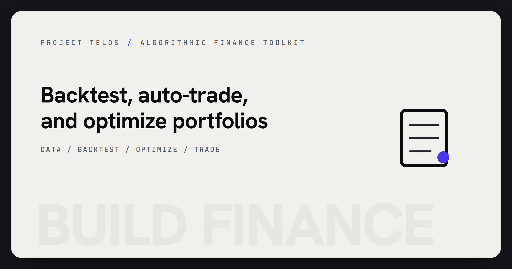

<p align="center">
  
</p>

# Build Finance

Algorithmic trading toolkit for stocks and crypto. Backtest strategies, auto-trade with paper or live brokers, optimize portfolios.

## Quick Start

```bash
pip install ".[all]"
build-finance
```

Launch the GUI, or use the CLI:

```bash
build-finance backtest --strategy momentum --days 252
build-finance optimize --method max_sharpe
build-finance indicators
```

## Features

### Trading Strategies (5)
- **Momentum** — EMA crossover + RSI filter
- **Mean Reversion** — Bollinger Band bounce
- **Trend Following** — MA crossover + ATR stops
- **Breakout** — N-period high/low with volume confirmation
- **Ensemble** — Weighted combination of all four (default)

### Technical Indicators (10)
SMA, EMA, RSI, MACD, Bollinger Bands, ATR, Stochastic, VWAP, ADX, OBV — all vectorized with numpy.

### Risk Metrics (14)
Sharpe, Sortino, Max Drawdown, Calmar, VaR (parametric + historical), CVaR, Beta, Alpha, Information Ratio, Volatility, Profit Factor, Win Rate.

### Backtesting Engine
- Event-driven simulation with slippage, commission, and market impact
- Walk-forward optimization
- Monte Carlo simulation (trade-order shuffling)
- Equity curve tracking with drawdown analysis

### Portfolio Optimization
- Mean-Variance (Markowitz) — max Sharpe, min variance, max return
- Black-Litterman — combine market equilibrium with investor views
- Hierarchical Risk Parity (HRP) — correlation-based clustering
- Risk Parity — equal risk contribution

### Auto-Trading
- Paper trading (simulated, no real money)
- Alpaca API (paper + live, stocks)
- Yahoo Finance data (stocks, free)
- CoinGecko data (crypto, free)
- Configurable: symbols, strategy, interval, risk per trade, max positions
- Runs both stocks and crypto simultaneously

### Market Data
- Yahoo Finance — real-time and historical (no API key)
- CoinGecko — crypto OHLC (no API key)
- CSV import/export (Yahoo, TradingView, generic)
- Synthetic data generation for testing

## GUI

Professional interface matching Calibrate Pro's design:

- **Dashboard** — Account overview, quick actions, recent activity
- **Backtest** — Run strategies with equity curve visualization and trade log
- **Auto-Trader** — Start/stop live trading with real-time status and activity log
- **Portfolio** — Optimize weights with visual allocation bars
- **Market Data** — Fetch and visualize price charts
- **Settings** — Broker API keys, default parameters

## CLI Commands

| Command | Description |
|---------|-------------|
| `build-finance` | Launch GUI (default) |
| `build-finance backtest` | Run backtest with strategy selection |
| `build-finance analyze` | Analyze trades from CSV |
| `build-finance optimize` | Portfolio optimization |
| `build-finance indicators` | Compute technical indicators |
| `build-finance gui` | Launch GUI explicitly |

## Architecture

```
build_finance/
  data.py          Market data structures (Candle, Quote, Signal, Trade, Position)
  indicators.py    10 vectorized technical indicators
  strategies.py    5 trading strategies
  risk.py          14 risk metrics
  sizing.py        5 position sizing methods
  orderbook.py     Order execution simulation
  backtest.py      Backtesting engine (walk-forward, Monte Carlo)
  portfolio.py     Portfolio optimization (MV, BL, HRP, RP)
  market_data.py   Yahoo Finance, CoinGecko, CSV I/O
  broker.py        Paper trading + Alpaca API
  autotrader.py    Automated trading engine
  cli.py           Command-line interface
  gui/             PyQt6 professional interface (6 pages)
```

## License

Copyright (c) 2022-2026 Zain Dana Harper. All rights reserved. See [LICENSE](LICENSE).
